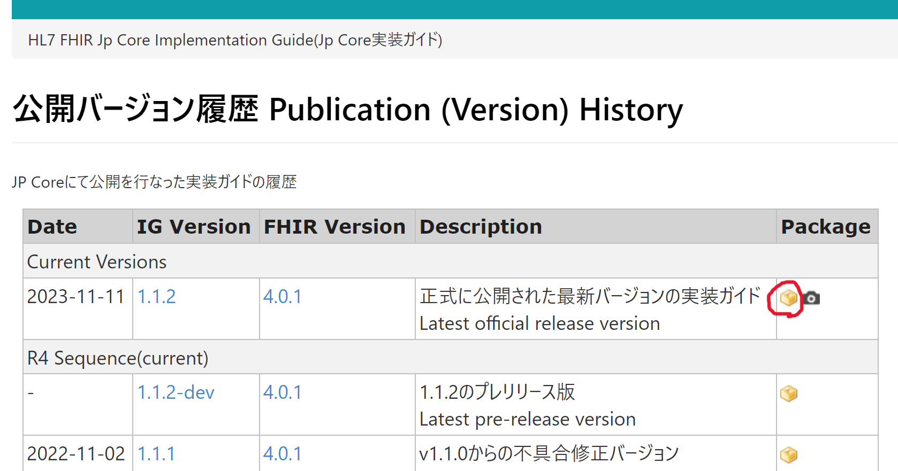
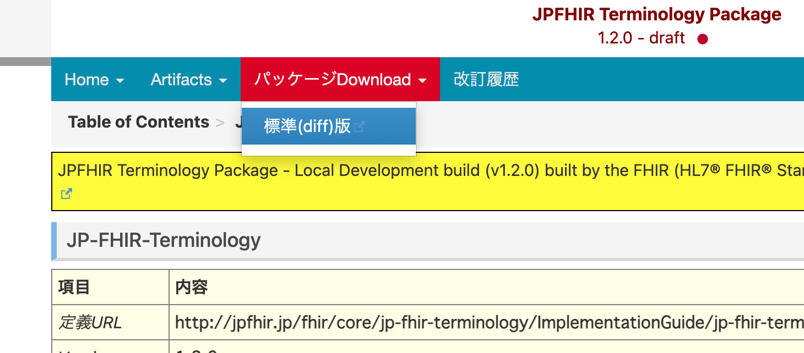
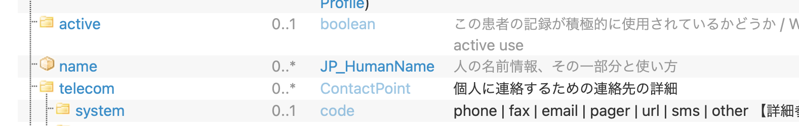
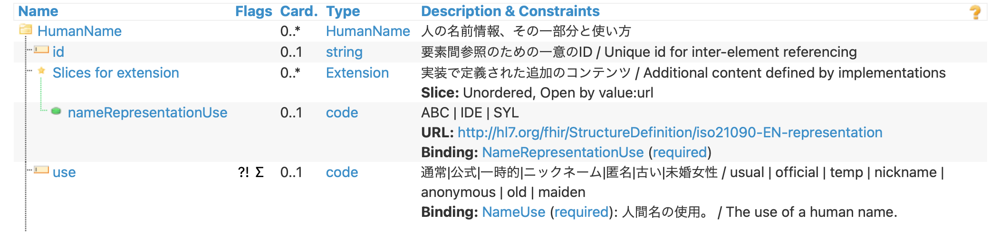

一通りドキュメントにあるクイックスタートの内容は試してみました。

そこでサーバーの設定ファイル `configs/original.application.yaml` を見てみると、`implementationguides` というプロパティが 110 行目あたりにありました。そこで、一部コメントアウトを外して実際に IG をインストールしてみましょう。

# FHIR IPS パッケージをダウンロードしてインストールしてみる

パッケージレジストリ (packages.fhir.org) なるものからインストールすることもできるようですが、今回は `package.tgz` をダウンロードしてくる方式を試そうと思います。

`configs/original.application.yaml` を以下のように変更して `configs/ig.application.yaml` を作成しました。

```diff
-    #implementationguides:
+    implementationguides:
     ###    example from registry (packages.fhir.org)
     #  swiss:
     #    name: swiss.mednet.fhir
     #    version: 0.8.0
     #    reloadExisting: false
     #    installMode: STORE_AND_INSTALL
     #      example not from registry
-    #      ips_1_0_0:
-    #        packageUrl: https://build.fhir.org/ig/HL7/fhir-ips/package.tgz
-    #        name: hl7.fhir.uv.ips
-    #        version: 1.0.0
+      ips_1_0_0:
+        packageUrl: https://build.fhir.org/ig/HL7/fhir-ips/package.tgz
+        name: hl7.fhir.uv.ips
+        version: 1.0.0
```

この設定ファイルを読み込ませるように以下のような `compose/compose.ig-ips.yml` を作成します。見ての通り、今回はデータの永続化はしないようにします。

```yaml
services:
  fhir:
    container_name: fhir
    image: "hapiproject/hapi:latest"
    ports:
      - "8080:8080"
    configs:
      - source: hapi
        target: /app/config/application.yaml

configs:
  hapi:
     file: ../configs/ig.application.yaml
```

準備が整ったので、以下のコマンドでサーバーを起動してみましょう。

```bash
docker compose -f compose/compose.ig-ips.yml up -d
```

しばらくしたら、以下のコマンドでログを確認してみましょう。

```bash
docker logs -f fhir
```

エラーが発生していました。

最後のエラー部分のメッセージは以下のようになっていました。

```text
Caused by: ca.uhn.fhir.rest.server.exceptions.InvalidRequestException: HAPI-1298: Package ID 2.0.0-ballot doesn't match expected: 1.0.0
```

バージョンが合ってないと言われています。とりあえず一度作成したコンテナを削除しましょう。

```bash
docker compose -f compose/compose.ig-ips.yml down
```

IG の実際のバージョンと設定ファイルに指定したものが合っていないということだと思いますが、IG のバージョンってどこでわかるんでしょう？

## バージョンの確認

一度、ローカルに URL で指定されている tgz ファイルをダウンロードして展開してみます。

```bash
curl "https://build.fhir.org/ig/HL7/fhir-ips/package.tgz" | tar -xz
```

上記のコマンドを実行すると、ローカルに `package` ディレクトリが作成されます。この中を見てみると NPM パッケージにありがちな `package.json` があり、内容は以下のようになっていました。

```json
{
  "name" : "hl7.fhir.uv.ips",
  "version" : "2.0.0-ballot",
  "tools-version" : 3,
  "type" : "IG",
  "date" : "20240712200248",
  "license" : "CC0-1.0",
  "canonical" : "http://hl7.org/fhir/uv/ips",
  "notForPublication" : true,
  "url" : "https://build.fhir.org/ig/HL7/fhir-ips/",
  "title" : "International Patient Summary Implementation Guide",
  "fhirVersions" : ["4.0.1"],
  "dependencies" : {
    "hl7.fhir.r4.core" : "4.0.1",
    "hl7.terminology.r4" : "5.5.0",
    "hl7.fhir.uv.extensions.r4" : "5.1.0",
    "fhir.dicom" : "2024.2.20240331"
  },
  "author" : "HL7 International / Patient Care",
  "maintainers" : [
    {
      "name" : "HL7 International / Patient Care",
      "url" : "http://www.hl7.org/Special/committees/patientcare"
    }
  ],
  "directories" : {
    "lib" : "package",
    "example" : "example"
  },
  "jurisdiction" : "http://unstats.un.org/unsd/methods/m49/m49.htm#001"
}
```

これを見ると、バージョンのプロパティ値が `2.0.0-ballot` になっています。これを設定ファイルにも適用してみましょう。

## IPS パッケージのバージョンを変更して再起動

以下のように変更して `configs/ips-2.0.0-ballot.application.yaml` を作成しました。

```diff
       ips_1_0_0:
         packageUrl: https://build.fhir.org/ig/HL7/fhir-ips/package.tgz
         name: hl7.fhir.uv.ips
-        version: 1.0.0
+        version: 2.0.0-ballot
```

これを読み込むように合わせて `compose/compose.ig-ips.yml` を以下のように修正して `compose/compose.ig-ips-2.0.0-ballot.yml` を作成しました。

```diff
 configs:
   hapi:
-     file: ../configs/ig.application.yaml
+     file: ../configs/ips-2.0.0-ballot.application.yaml
```

では以下のコマンドでもう一度立ち上げてみます。

```bash
docker compose -f compose/compose.ig-ips-2.0.0-ballot.yml up -d
```

しばらくしてログを確認すると以下のようなログが出ていました。指定されたパッケージを読み込んで `StructureDefinition` リソースをインデクシングしているようなので、指定したパッケージをきちんと読み込んでいるようです。そして最後にアプリケーションが開始された旨のログが出ているので、うまくいっていそうです。

```text
(省略)

2024-07-14 03:28:16.530 [main] INFO  c.u.f.j.p.loader.PackageLoaderSvc [PackageLoaderSvc.java:116] Parsing package .tar.gz (1032841 bytes) from https://build.fhir.org/ig/HL7/fhir-ips/package.tgz
2024-07-14 03:28:17.460 [main] INFO  ca.uhn.fhir.context.FhirContext [FhirContext.java:226] Creating new FHIR context for FHIR version [R4]
2024-07-14 03:28:17.827 [main] INFO  c.u.f.j.s.r.JpaSearchParamCache [JpaSearchParamCache.java:182] Have 0 unique search params
2024-07-14 03:28:18.408 [main] INFO  c.u.f.jpa.packages.JpaPackageCache [JpaPackageCache.java:417] Package[hl7.fhir.uv.ips#2.0.0-ballot] Indexing StructureDefinition Resource[package/StructureDefinition-AllergyIntolerance-uv-ips.json] with URL: http://hl7.org/fhir/uv/ips/StructureDefinition/AllergyIntolerance-uv-ips|2.0.0-ballot
2024-07-14 03:28:18.813 [main] INFO  c.u.f.jpa.packages.JpaPackageCache [JpaPackageCache.java:417] Package[hl7.fhir.uv.ips#2.0.0-ballot] Indexing StructureDefinition Resource[package/StructureDefinition-Bundle-uv-ips.json] with URL: http://hl7.org/fhir/uv/ips/StructureDefinition/Bundle-uv-ips|2.0.0-ballot

(省略)

2024-07-14 03:28:25.080 [main] INFO  ca.uhn.fhir.jpa.starter.Application [StartupInfoLogger.java:56] Started Application in 47.75 seconds (process running for 49.034)

(省略)
```

ちゃんとインストールされているか確かめるために、リソースを登録したいところですが、せっかくなので次の章で JP Core をインストールして検証してみます。一旦ここで立ち上げたコンテナは削除してしまいましょう。

```bash
docker compose -f compose/compose.ig-ips-2.0.0-ballot.yml down
```

# JP Core のインストール

## JP Core

JP Core の最新パッケージは [JP Core の公開バージョン履歴のページ](https://jpfhir.jp/fhir/core/index.html)の、赤枠部分からパッケージのダウンロードをすることができます。



HAPI FHIR JPA サーバーの場合は、パッケージをダウンロードできる URL を指定するだけで良いので、リンクのアドレスだけコピーしてきます。以下のような URL がコピーできます。

<https://jpfhir.jp/fhir/core/1.1.2/jp-core.r4-1.1.2.tgz>

バージョンは `1.1.2` で良いかと思いますが、名前はどうすればいいでしょうか？先ほどと同じようにローカルにダウンロードして展開してみましょう。ページ上にあるボタンからダウンロードすれば問題ありませんが、コマンドでの展開方法も以下に示しておきます。

```bash
curl "https://jpfhir.jp/fhir/core/1.1.2/jp-core.r4-1.1.2.tgz" | tar -xz
```

展開された `package` ディレクトリ内にある `package.json` は以下のようになっていました。

```json
{
  "name": "jp-core.r4",
  "version": "1.1.2",
  "description": "JP-CORE V1.1.2 differential package for release",
  "author": "JAMI NeXEHRS FHIR IGWG",
  "fhirVersions": [
    "4.0.1"
  ],
  "dependencies": {
    "hl7.fhir.r4.core": "4.0.1"
  },
  "url": "http://jpfhir.jp/fhir/core",
  "canonical": "http://jpfhir.jp/fhir/core"
}
```

`name` は `jp-core.r4`, `version` は `1.1.2` とすれば良さそうです。

## JP Core Terminology

JP Core の Terminology も取り込んでおきましょう。ホームページは[こちら](https://jpfhir.jp/fhir/core/terminology/ig/index.html)ですが、改訂履歴には各バージョンのスナップショットは公開していないみたいです。

なのでダウンロードは画像のところから行います。



ダウンロードの URL は以下のようになりました。

<https://jpfhir.jp/fhir/core/terminology/jpfhir-terminology.r4-1.2.0.tgz>

前と同様に、展開してみて名前とバージョンを確認してみましょう。

```bash
curl "https://jpfhir.jp/fhir/core/terminology/jpfhir-terminology.r4-1.2.0.tgz" | tar -xz
```

`package.json` は以下のようになっていました。

```json
{
    "name": "jpfhir-terminology",
    "version": "1.2.0",
    "description": "jpfhir-terminology 1.2.0",
    "author": "Kazuhiko Ohe",
    "fhirVersions": [
        "4.0.1"
    ],
    "dependencies": {
        "hl7.fhir.r4.core": "4.0.1"
    },
    "tools-version": 3,
    "type": "IG",
    "url": "http://jpfhir.jp/fhir/jpfhir-terminology",
    "canonical": "http://jpfhir.jp/fhir/jpfhir-terminology"
}
```

したがって、名前は `jpfhir-terminology` でバージョンは `1.2.0` とすれば良さそうです。

## 設定ファイル作成

では、以下のように `configs/ig-ips.application.yaml` を編集してみます。編集したファイルは `configs/ig-jp-core-1.1.2.application.yaml` として保存しました。

```diff
-      ips_1_0_0:
-        packageUrl: https://build.fhir.org/ig/HL7/fhir-ips/package.tgz
-        name: hl7.fhir.uv.ips
-        version: 1.0.0
+      jp_core_r4_1_1_2:
+        packageUrl: https://jpfhir.jp/fhir/core/1.1.2/jp-core.r4-1.1.2.tgz
+        name: jp-core.r4
+        version: 1.1.2
+      jpfhir_terminology_r4_1_2_0:
+        packageUrl: https://jpfhir.jp/fhir/core/terminology/jpfhir-terminology.r4-1.2.0.tgz
+        name: jpfhir-terminology
+        version: 1.2.0
```

また、リソースの作成時にリソースを検証するために、以下のような設定を追加します。

```diff
         refuse_to_fetch_third_party_urls: false
         fhir_version: R4
-    #    validation:
-    #      requests_enabled: true
+    validation:
+      requests_enabled: true
     #      responses_enabled: true
     #    binary_storage_enabled: true
```

この設定ファイルを読み込むため、`compose/compose.ig-ips.yml` を以下のように編集して `compose/compose.ig-jp-core-1.1.2.yml` として保存します。

```diff
 configs:
   hapi:
-     file: ../configs/ig.application.yaml
+     file: ../configs/ig-jp-core-1.1.2.application.yaml
```

## 実験

それでは以下のコマンドで実行してみましょう。

```bash
docker compose -f compose/compose.ig-jp-core-1.1.2.yml up -d
```

起動は問題なさそうです。

では、リソースを登録してみましょう。まずは以下の URL に公開されている JP Core の `Patient` リソースをダウンロードしてきます。ここでは以下のコマンドで `resources/04-jp-core-patient-example.json` として保存します。

<https://jpfhir.jp/fhir/core/1.1.2/Patient-jp-patient-example-1.json.html>

```bash
curl -o resources/04-jp-core-patient-example.json \
    "https://jpfhir.jp/fhir/core/1.1.2/Patient-jp-patient-example-1.json"
```

プロファイルに参照部分はなさそうなので、このまま登録してみます。

```bash
curl -X POST \
    -d @resources/04-jp-core-patient-example.json \
    -H "Content-Type: application/fhir+json" \
    -o results/06-jp-core-patient-example.json \
    "http://localhost:8080/fhir/Patient"
```

5 秒ほど経つと登録が完了し、結果 `results/06-jp-core-patient-example.json` が出力されました。とりあえずはできていそうです。

では仕様に違反するように、`Patient` リソースを以下のように変更して登録を試してみましょう。

[JP Core Patient Profile の仕様](https://jpfhir.jp/fhir/core/1.1.2/StructureDefinition-jp-patient.html)の中で Differential Table を見ていくと、JP Core では JP_HumanName というデータ型を使っていることがわかります。



さらに [JP_HumanName の仕様](https://jpfhir.jp/fhir/core/1.1.2/StructureDefinition-jp-humanname.html)を見てみると、`extension` が [`NameRepresentationUse`](http://hl7.org/fhir/extensions/5.1.0/ValueSet-name-v3-representation.html) にバインドされて、かつ多重度は `0..1` となっています。



では、この多重度のルールに違反するよう、以下のように修正して `resources/05-jp-core-patient-example-invalid.json` というリソースを作成します。

```diff
   "name" : [{
     "extension" : [{
       "url" : "http://hl7.org/fhir/StructureDefinition/iso21090-EN-representation",
       "valueCode" : "IDE"
+    }, {
+      "url" : "http://hl7.org/fhir/StructureDefinition/iso21090-EN-representation",
+      "valueCode" : "ABC"
     }],
     "use" : "usual",
     "text" : "山田 太郎",
     "family" : "山田",
     "given" : ["太郎"]
   },
```

このリソースを保存しようとすればエラーになるはずです。以下のコマンドで実験してみます。

```bash
curl -i -X POST \
    -d @resources/05-jp-core-patient-example-invalid.json \
    -H "Content-Type: application/fhir+json" \
    "http://localhost:8080/fhir/Patient"
```

上のコマンドを実行すると以下のような出力を得ました。

```text
HTTP/1.1 422
X-Powered-By: HAPI FHIR 7.2.0 REST Server (FHIR Server; FHIR 4.0.1/R4)
X-Request-ID: MPlSfyMqk7B1OZOf
Content-Type: application/fhir+json;charset=UTF-8
Transfer-Encoding: chunked
Date: Sun, 21 Jul 2024 13:32:52 GMT

{
  "resourceType": "OperationOutcome",
  "issue": [ {
    "extension": [ {
      "url": "http://hl7.org/fhir/StructureDefinition/operationoutcome-issue-line",
      "valueInteger": 1
    }, {
      "url": "http://hl7.org/fhir/StructureDefinition/operationoutcome-issue-col",
      "valueInteger": 3014
    }, {
      "url": "http://hl7.org/fhir/StructureDefinition/operationoutcome-message-id",
      "valueString": "Validation_VAL_Profile_Maximum"
    } ],
    "severity": "error",
    "code": "processing",
    "details": {
      "coding": [ {
        "system": "http://hl7.org/fhir/java-core-messageId",
        "code": "Validation_VAL_Profile_Maximum"
      } ]
    },
    "diagnostics": "HumanName.extension:nameRepresentationUse: max allowed = 1, but found 2 (from http://jpfhir.jp/fhir/core/StructureDefinition/JP_HumanName)",
    "location": [ "Patient.name[0]", "Line[1] Col[3014]" ]
  } ]
}
```

上を見ての通り、HTTP のリスポンスステータスは [422 (Unprocessable Entity)](https://developer.mozilla.org/ja/docs/Web/HTTP/Status/422) となりました。`diagnostics` プロパティにエラーの詳細が入っていて、予想通り、一つしか指定できない旨のエラー内容となっています。しっかりとリソースの検証を保存前にしてくれました。

`MedicationRequest` リソースも試してみましょう。以下の URL にあるリソースをダウンロードしてきます。コマンドでダウンロードする場合は以下のようにして `resources/06-medication-request-example.json` としました。

<https://jpfhir.jp/fhir/core/1.1.2/MedicationRequest-jp-medicationrequest-example-2.json.html>

```bash
curl -o resources/06-medication-request-example.json \
    "https://jpfhir.jp/fhir/core/1.1.2/MedicationRequest-jp-medicationrequest-example-2.json"
```

中を見てみると `subject` が `Patient` リソースへの参照になっているので、さっき登録した患者の ID を指定します。`results/06-jp-core-patient-example.json` で `id` が `407` となっているので、それを以下のように指定します。

```diff
   "subject" : {
-    "reference" : "Patient/jp-patient-example-1"
+    "reference" : "Patient/407"
   },
```

ではこれを以下のコマンドで登録してみます。

```bash
curl -X POST \
    -d @resources/06-medication-request-example.json \
    -H "Content-Type: application/fhir+json" \
    -o results/07-medication-request-example.json \
    "http://localhost:8080/fhir/MedicationRequest"
```

かなり時間がかかります。。。

結局 5 分ほど経ってようやく終わりました。出力されたファイル `results/07-medication-request-example.json` を見てみると以下のようにエラーが返ってきていました。

```json
{
  "resourceType": "OperationOutcome",
  "issue": [ {
    "severity": "error",
    "code": "processing",
    "diagnostics": "HAPI-1910: Failure invoking interceptor for pointcut(s) SERVER_INCOMING_REQUEST_POST_PROCESSED"
  } ]
}
```

ログを見てみると以下のような出力が最後の方にありました。

```text
        at org.apache.tomcat.util.threads.TaskThread$WrappingRunnable.run(TaskThread.java:61)
        at java.base/java.lang.Thread.run(Thread.java:840)
Caused by: java.lang.OutOfMemoryError: Java heap space
2024-07-21 13:53:38.169 [http-nio-8080-exec-4] INFO  fhirtest.access [LoggingInterceptor.java:164] ERROR - POST http://localhost:8080/fhir/MedicationRequest
```

メモリが足りないようなエラーです。

コンテナ内での `java` の実行時に `-Xmx5g` などとコマンドを書き換えてやってみたりしてみたのですが、どれもうまくいかなかったです（解決法を知っている方がいましたらご教授ください）。

とりあえず、自分にできることはもうなさそうですし、リソースの検証もやってくれていることは確認できたので、このくらいにしておこうかと思います。
