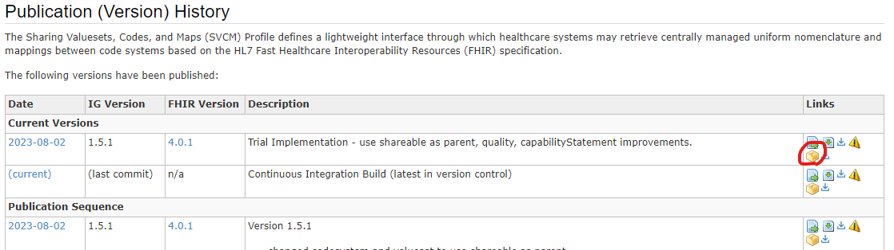

SVCM プロファイルという IG を HAPI FHIR JPA Server にインストールして Terminology サーバーとして立ち上げてみます。

# SVCM とは

SVCM は "Sharing Valuesets, Codes, and Maps" の略称で、ヘルスケアシステムが集中管理された一様な命名法と、コードシステム間のマッピングを取得することができるための、軽量なインターフェイスを定義しています。以下は SVCM プロファイルのホームページです。

<https://profiles.ihe.net/ITI/SVCM/index.html>

過去のバージョン一覧やパッケージのダウンロードは以下のページから可能です。

<https://profiles.ihe.net/ITI/SVCM/history.html>

今回は現時点での最新版であるバージョン 1.5.1 を、赤枠で囲ったボタンから入手します。



# 起動してみる

## 設定ファイルの作成

今までと同様に `configs/original.application.yaml` を以下のように変更して `configs/ig.application.yaml` を作成しました。下記を見て分かるように、今回は PostgreSQL データベースに永続化しようと思います。

```diff
     fail-on-missing-locations: false
   datasource:
     #url: 'jdbc:h2:file:./target/database/h2'
-    url: jdbc:h2:mem:test_mem
-    username: sa
-    password: null
-    driverClassName: org.h2.Driver
+    url: 'jdbc:postgresql://db:5432/hapi'
+    username: admin
+    password: admin
+    driverClassName: org.postgresql.Driver
     max-active: 15

     # database connection pool size
     hikari:
       maximum-pool-size: 10
   jpa:
     properties:
       hibernate.format_sql: false
       hibernate.show_sql: false

       #Hibernate dialect is automatically detected except Postgres and H2.
       #If using H2, then supply the value of ca.uhn.fhir.jpa.model.dialect.HapiFhirH2Dialect
       #If using postgres, then supply the value of ca.uhn.fhir.jpa.model.dialect.HapiFhirPostgres94Dialect
-      hibernate.dialect: ca.uhn.fhir.jpa.model.dialect.HapiFhirH2Dialect
+      hibernate.dialect: ca.uhn.fhir.jpa.model.dialect.HapiFhirPostgres94Dialect
   #      hibernate.cache.use_query_cache: false
   #      hibernate.cache.use_second_level_cache: false
   #      hibernate.cache.use_structured_entries: false
   #      hibernate.cache.use_minimal_puts: false

   ###    These settings will enable fulltext search with lucene or elastic
-      hibernate.search.enabled: true
+      hibernate.search.enabled: false
   ### lucene parameters
 #      hibernate.search.backend.type: lucene
 #      hibernate.search.backend.analysis.configurer: ca.uhn.fhir.jpa.search.HapiHSearchAnalysisConfigurers$HapiLuceneAnalysisConfigurer
```

また SVCM のプロファイルをインストールするような設定に加えて、サポート対象のリソースタイプを `CodeSystem`, `ConceptMap`, `ValueSet`, `AuditEvent`, `CapabilityStatement` に限定するようにしました。

```diff
     #    server_address: http://hapi.fhir.org/baseR4
     #    defer_indexing_for_codesystems_of_size: 101
     #    install_transitive_ig_dependencies: true
-    #implementationguides:
-    ###    example from registry (packages.fhir.org)
-    #  swiss:
-    #    name: swiss.mednet.fhir
-    #    version: 0.8.0
-    #    reloadExisting: false
-    #    installMode: STORE_AND_INSTALL
-    #      example not from registry
-    #      ips_1_0_0:
-    #        packageUrl: https://build.fhir.org/ig/HL7/fhir-ips/package.tgz
-    #        name: hl7.fhir.uv.ips
-    #        version: 1.0.0
-    #    supported_resource_types:
-    #      - Patient
-    #      - Observation
+    implementationguides:
+      svcm_1_5_1:
+        packageUrl: https://profiles.ihe.net/ITI/SVCM/package.tgz
+        name: ihe.iti.svcm
+        version: 1.5.1
+    supported_resource_types:
+      - CodeSystem
+      - ConceptMap
+      - ValueSet
+      - AuditEvent
+      - CapabilityStatement
     ##################################################
     # Allowed Bundle Types for persistence (defaults are: COLLECTION,DOCUMENT,MESSAGE)
     ##################################################
```

## Compose ファイルの作成

以下のような `compose/compose.ig-svcm.yml` ファイルを作成しました。これで HAPI FHIR JPA Server と PostgreSQL コンテナを起動します。

```yml
services:
  fhir:
    container_name: fhir
    image: "hapiproject/hapi:v7.2.0"
    ports:
      - "8080:8080"
    configs:
      - source: hapi
        target: /app/config/application.yaml
    depends_on:
      - db

  db:
    image: postgres:16
    environment:
      POSTGRES_PASSWORD: admin
      POSTGRES_USER: admin
      POSTGRES_DB: hapi
    volumes:
      - ../data/hapi.postgres.data:/var/lib/postgresql/data

configs:
  hapi:
     file: ../configs/ig-svcm-1.5.1.application.yaml
```

## 起動

これで準備は整ったので、以下のコマンドでサーバーを立ち上げます。

```bash
docker compose -f compose/compose.ig-svcm.yml up -d
```

## CapabilityStatement 取得

試しに `CapabilityStatement` を以下のコマンドで取得してみます。

```bash
curl -o results/11-svcm-capability-statements.json \
    'http://localhost:8080/fhir/metadata'
```

出力されたファイルを確認すると以下のようになっていました。

```json
{
  "resourceType": "OperationOutcome",
  "issue": [ {
    "severity": "error",
    "code": "processing",
    "diagnostics": "HAPI-0389: Failed to call access method: java.lang.RuntimeException: HAPI-1305: Failed to load package resource NpmPackageVersionResourceEntity[myId=1,myCanonicalUrl=https://profiles.ihe.net/ITI/SVCM/StructureDefinition/IHE.SVCM.Audit.Code.Validate,myCanonicalVersion=1.5.1,myResourceType=StructureDefinition,myDirectory=package,myFilename=StructureDefinition-IHE.SVCM.Audit.Code.Validate.json,myPackageVersion=NpmPackageVersionEntity[myId=1,myPackageId=ihe.iti.svcm,myVersionId=1.5.1,myDescriptionUpper=THE SHARING VALUESETS, CODES, AND MAPS (SVCM) PROFILE DEFINES A LIGHTWEIGHT INTERFACE THROUGH WHICH HEALTHCARE SYSTEMS MAY RETRIEVE CENTRALLY MANAGED UNIFORM NOMENCLATURE AND MAPPINGS BETWEEN CODE...,myFhirVersionId=4.0.1],myResSizeBytes=256338,myVersion=2024-07-25 06:25:07.711286]"
  } ]
}
```

## エラー解決

パッケージを読み込むときに失敗しているようです。ログを確認してみますと以下のようなログが出ていました。

```text
(省略)
2024-07-25 06:25:28.679 [http-nio-8080-exec-1] ERROR c.u.f.r.s.i.ExceptionHandlingInterceptor [ExceptionHandlingInterceptor.java:198] Failure during REST processing
ca.uhn.fhir.rest.server.exceptions.InternalErrorException: HAPI-0389: Failed to call access method: java.lang.RuntimeException: HAPI-1305: (省略)
        at ca.uhn.fhir.rest.server.method.BaseMethodBinding.invokeServerMethod(BaseMethodBinding.java:272)
        at ca.uhn.fhir.rest.server.method.ConformanceMethodBinding.createCapabilityStatement(ConformanceMethodBinding.java:186)
(省略)
        at org.apache.tomcat.util.threads.TaskThread$WrappingRunnable.run(TaskThread.java:61)
        at java.base/java.lang.Thread.run(Thread.java:840)
Caused by: java.lang.reflect.InvocationTargetException: null
        at java.base/jdk.internal.reflect.NativeMethodAccessorImpl.invoke0(Native Method)
        at java.base/jdk.internal.reflect.NativeMethodAccessorImpl.invoke(NativeMethodAccessorImpl.java:77)
        at java.base/jdk.internal.reflect.DelegatingMethodAccessorImpl.invoke(DelegatingMethodAccessorImpl.java:43)
        at java.base/java.lang.reflect.Method.invoke(Method.java:568)
        at ca.uhn.fhir.rest.server.method.BaseMethodBinding.invokeServerMethod(BaseMethodBinding.java:264)
        ... 38 common frames omitted
Caused by: java.lang.RuntimeException: HAPI-1305: Failed to load package resource NpmPackageVersionResourceEntity[myId=1,(省略)
        at ca.uhn.fhir.jpa.packages.JpaPackageCache.loadPackageEntity(JpaPackageCache.java:602)
        at ca.uhn.fhir.jpa.packages.JpaPackageCache.lambda$loadPackageAssetsByType$10(JpaPackageCache.java:774)
(省略)
        at ca.uhn.fhir.rest.server.provider.ServerCapabilityStatementProvider.getSupportedProfileMultimap(ServerCapabilityStatementProvider.java:614)
        at ca.uhn.fhir.rest.server.provider.ServerCapabilityStatementProvider.getServerConformance(ServerCapabilityStatementProvider.java:205)
        ... 43 common frames omitted
Caused by: ca.uhn.fhir.rest.server.exceptions.InvalidRequestException: HAPI-0572: Unable to process request, this server does not know how to handle resources of type Binary - Can handle: [AuditEvent, CapabilityStatement, CodeSystem, ConceptMap, SearchParameter, ValueSet]
        at ca.uhn.fhir.jpa.api.dao.DaoRegistry.getResourceDao(DaoRegistry.java:102)
        at ca.uhn.fhir.jpa.packages.JpaPackageCache.getBinaryDao(JpaPackageCache.java:259)
        at ca.uhn.fhir.jpa.packages.JpaPackageCache.loadPackageEntity(JpaPackageCache.java:594)
        ... 88 common frames omitted
2024-07-25 06:25:28.693 [http-nio-8080-exec-1] INFO  fhirtest.access [LoggingInterceptor.java:164] ERROR - GET http://localhost:8080/fhir/metadata
```

最後の方に `Binary` タイプのリソースをハンドルできないというエラーが出ていました。設定の `supported_resource_types` に指定していないことが問題みたいです。

そこで、以下のように `Binary` リソースに対応するような設定を追加しました。

```diff
     supported_resource_types:
       - CodeSystem
       - ConceptMap
       - ValueSet
       - AuditEvent
       - CapabilityStatement
+      - Binary
     ##################################################
     # Allowed Bundle Types for persistence (defaults are: COLLECTION,DOCUMENT,MESSAGE)
     ##################################################
```

では以下のコマンドで再起動してみましょう。

```bash
docker compose -f compose/compose.ig-svcm.yml restart
```

以下のコマンドでもう一度 `CapabilityStatement` を取得してみます。

```bash
curl -o results/12-svcm-capability-statements-fixed.json \
    'http://localhost:8080/fhir/metadata'
```

無事に取得できました。プロファイルも SVCM のものが追加されているので問題なさそうです。

# サンプルデータの登録

以下の SVCM の IG サイトで `ValueSet`, `CodeSystem`, `ConceptMap` 例が5つ公開されているので、それを登録します。

<https://profiles.ihe.net/ITI/SVCM/artifacts.html>

コマンドで以下のように登録できます。

```bash
curl 'https://profiles.ihe.net/ITI/SVCM/ValueSet-svcm-example2-valueset.json' \
    | curl -X POST -H 'Content-Type: application/fhir+json' \
        -o results/13-svcm-example2-valueset.json \
        -d @- 'http://localhost:8080/fhir/ValueSet'

curl 'https://profiles.ihe.net/ITI/SVCM/CodeSystem-svcm-example-codesystem.json' \
    | curl -X POST -H 'Content-Type: application/fhir+json' \
        -o results/14-svcm-example-codesystem.json \
        -d @- 'http://localhost:8080/fhir/CodeSystem'

curl 'https://profiles.ihe.net/ITI/SVCM/CodeSystem-svcm-example-codesystem2.json' \
    | curl -X POST -H 'Content-Type: application/fhir+json' \
        -o results/15-svcm-example-codesystem2.json \
        -d @- 'http://localhost:8080/fhir/CodeSystem'

curl 'https://profiles.ihe.net/ITI/SVCM/ConceptMap-svcm-example-conceptmap.json' \
    | curl -X POST -H 'Content-Type: application/fhir+json' \
        -o results/16-svcm-example-conceptmap.json \
        -d @- 'http://localhost:8080/fhir/ConceptMap'

curl 'https://profiles.ihe.net/ITI/SVCM/ValueSet-svcm-example-valueset.json' \
    | curl -X POST -H 'Content-Type: application/fhir+json' \
        -o results/17-svcm-example-valueset.json \
        -d @- 'http://localhost:8080/fhir/ValueSet'
```

# SVCM ユースケース

