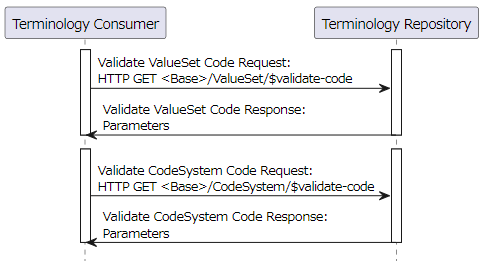

SVCM プロファイルという IG を HAPI FHIR JPA Server にインストールして Terminology サーバーとして立ち上げてみます。

# SVCM とは

SVCM は "Sharing Valuesets, Codes, and Maps" の略称で、ヘルスケアシステムが集中管理された一様な命名法と、コードシステム間のマッピングを取得することができるための、軽量なインターフェイスを定義しています。以下は SVCM プロファイルのホームページです。

<https://profiles.ihe.net/ITI/SVCM/index.html>

過去のバージョン一覧やパッケージのダウンロードは以下のページから可能です。

<https://profiles.ihe.net/ITI/SVCM/history.html>

今回は現時点での最新版であるバージョン 1.5.1 を、赤枠で囲ったボタンから入手します。


# 起動してみる

## 設定ファイルの作成

今までと同様に `configs/original.application.yaml` を以下のように変更して `configs/ig.application.yaml` を作成しました。下記を見て分かるように、今回は PostgreSQL データベースに永続化しようと思います。

```diff
     fail-on-missing-locations: false
   datasource:
     #url: 'jdbc:h2:file:./target/database/h2'
-    url: jdbc:h2:mem:test_mem
-    username: sa
-    password: null
-    driverClassName: org.h2.Driver
+    url: 'jdbc:postgresql://db:5432/hapi'
+    username: admin
+    password: admin
+    driverClassName: org.postgresql.Driver
     max-active: 15

     # database connection pool size
     hikari:
       maximum-pool-size: 10
   jpa:
     properties:
       hibernate.format_sql: false
       hibernate.show_sql: false

       #Hibernate dialect is automatically detected except Postgres and H2.
       #If using H2, then supply the value of ca.uhn.fhir.jpa.model.dialect.HapiFhirH2Dialect
       #If using postgres, then supply the value of ca.uhn.fhir.jpa.model.dialect.HapiFhirPostgres94Dialect
-      hibernate.dialect: ca.uhn.fhir.jpa.model.dialect.HapiFhirH2Dialect
+      hibernate.dialect: ca.uhn.fhir.jpa.model.dialect.HapiFhirPostgres94Dialect
   #      hibernate.cache.use_query_cache: false
   #      hibernate.cache.use_second_level_cache: false
   #      hibernate.cache.use_structured_entries: false
   #      hibernate.cache.use_minimal_puts: false

   ###    These settings will enable fulltext search with lucene or elastic
-      hibernate.search.enabled: true
+      hibernate.search.enabled: false
   ### lucene parameters
 #      hibernate.search.backend.type: lucene
 #      hibernate.search.backend.analysis.configurer: ca.uhn.fhir.jpa.search.HapiHSearchAnalysisConfigurers$HapiLuceneAnalysisConfigurer
```

また SVCM のプロファイルをインストールするような設定に加えて、サポート対象のリソースタイプを `CodeSystem`, `ConceptMap`, `ValueSet`, `AuditEvent`, `CapabilityStatement` に限定するようにしました。

```diff
     #    server_address: http://hapi.fhir.org/baseR4
     #    defer_indexing_for_codesystems_of_size: 101
     #    install_transitive_ig_dependencies: true
-    #implementationguides:
-    ###    example from registry (packages.fhir.org)
-    #  swiss:
-    #    name: swiss.mednet.fhir
-    #    version: 0.8.0
-    #    reloadExisting: false
-    #    installMode: STORE_AND_INSTALL
-    #      example not from registry
-    #      ips_1_0_0:
-    #        packageUrl: https://build.fhir.org/ig/HL7/fhir-ips/package.tgz
-    #        name: hl7.fhir.uv.ips
-    #        version: 1.0.0
-    #    supported_resource_types:
-    #      - Patient
-    #      - Observation
+    implementationguides:
+      svcm_1_5_1:
+        packageUrl: https://profiles.ihe.net/ITI/SVCM/package.tgz
+        name: ihe.iti.svcm
+        version: 1.5.1
+    supported_resource_types:
+      - CodeSystem
+      - ConceptMap
+      - ValueSet
+      - AuditEvent
+      - CapabilityStatement
     ##################################################
     # Allowed Bundle Types for persistence (defaults are: COLLECTION,DOCUMENT,MESSAGE)
     ##################################################
```

## Compose ファイルの作成

以下のような `compose/compose.ig-svcm.yml` ファイルを作成しました。これで HAPI FHIR JPA Server と PostgreSQL コンテナを起動します。

```yml
services:
  fhir:
    container_name: fhir
    image: "hapiproject/hapi:v7.2.0"
    ports:
      - "8080:8080"
    configs:
      - source: hapi
        target: /app/config/application.yaml
    depends_on:
      - db

  db:
    image: postgres:16
    environment:
      POSTGRES_PASSWORD: admin
      POSTGRES_USER: admin
      POSTGRES_DB: hapi
    volumes:
      - ../data/hapi.postgres.data:/var/lib/postgresql/data

configs:
  hapi:
     file: ../configs/ig-svcm-1.5.1.application.yaml
```

## 起動

これで準備は整ったので、以下のコマンドでサーバーを立ち上げます。

```bash
docker compose -f compose/compose.ig-svcm.yml up -d
```

## CapabilityStatement 取得

試しに `CapabilityStatement` を以下のコマンドで取得してみます。

```bash
curl -o results/11-svcm-capability-statements.json \
    'http://localhost:8080/fhir/metadata'
```

出力されたファイルを確認すると以下のようになっていました。

```json
{
  "resourceType": "OperationOutcome",
  "issue": [ {
    "severity": "error",
    "code": "processing",
    "diagnostics": "HAPI-0389: Failed to call access method: java.lang.RuntimeException: HAPI-1305: Failed to load package resource NpmPackageVersionResourceEntity[myId=1,myCanonicalUrl=https://profiles.ihe.net/ITI/SVCM/StructureDefinition/IHE.SVCM.Audit.Code.Validate,myCanonicalVersion=1.5.1,myResourceType=StructureDefinition,myDirectory=package,myFilename=StructureDefinition-IHE.SVCM.Audit.Code.Validate.json,myPackageVersion=NpmPackageVersionEntity[myId=1,myPackageId=ihe.iti.svcm,myVersionId=1.5.1,myDescriptionUpper=THE SHARING VALUESETS, CODES, AND MAPS (SVCM) PROFILE DEFINES A LIGHTWEIGHT INTERFACE THROUGH WHICH HEALTHCARE SYSTEMS MAY RETRIEVE CENTRALLY MANAGED UNIFORM NOMENCLATURE AND MAPPINGS BETWEEN CODE...,myFhirVersionId=4.0.1],myResSizeBytes=256338,myVersion=2024-07-25 06:25:07.711286]"
  } ]
}
```

## エラー解決

パッケージを読み込むときに失敗しているようです。ログを確認してみますと以下のようなログが出ていました。

```text
(省略)
2024-07-25 06:25:28.679 [http-nio-8080-exec-1] ERROR c.u.f.r.s.i.ExceptionHandlingInterceptor [ExceptionHandlingInterceptor.java:198] Failure during REST processing
ca.uhn.fhir.rest.server.exceptions.InternalErrorException: HAPI-0389: Failed to call access method: java.lang.RuntimeException: HAPI-1305: (省略)
        at ca.uhn.fhir.rest.server.method.BaseMethodBinding.invokeServerMethod(BaseMethodBinding.java:272)
        at ca.uhn.fhir.rest.server.method.ConformanceMethodBinding.createCapabilityStatement(ConformanceMethodBinding.java:186)
(省略)
        at org.apache.tomcat.util.threads.TaskThread$WrappingRunnable.run(TaskThread.java:61)
        at java.base/java.lang.Thread.run(Thread.java:840)
Caused by: java.lang.reflect.InvocationTargetException: null
        at java.base/jdk.internal.reflect.NativeMethodAccessorImpl.invoke0(Native Method)
        at java.base/jdk.internal.reflect.NativeMethodAccessorImpl.invoke(NativeMethodAccessorImpl.java:77)
        at java.base/jdk.internal.reflect.DelegatingMethodAccessorImpl.invoke(DelegatingMethodAccessorImpl.java:43)
        at java.base/java.lang.reflect.Method.invoke(Method.java:568)
        at ca.uhn.fhir.rest.server.method.BaseMethodBinding.invokeServerMethod(BaseMethodBinding.java:264)
        ... 38 common frames omitted
Caused by: java.lang.RuntimeException: HAPI-1305: Failed to load package resource NpmPackageVersionResourceEntity[myId=1,(省略)
        at ca.uhn.fhir.jpa.packages.JpaPackageCache.loadPackageEntity(JpaPackageCache.java:602)
        at ca.uhn.fhir.jpa.packages.JpaPackageCache.lambda$loadPackageAssetsByType$10(JpaPackageCache.java:774)
(省略)
        at ca.uhn.fhir.rest.server.provider.ServerCapabilityStatementProvider.getSupportedProfileMultimap(ServerCapabilityStatementProvider.java:614)
        at ca.uhn.fhir.rest.server.provider.ServerCapabilityStatementProvider.getServerConformance(ServerCapabilityStatementProvider.java:205)
        ... 43 common frames omitted
Caused by: ca.uhn.fhir.rest.server.exceptions.InvalidRequestException: HAPI-0572: Unable to process request, this server does not know how to handle resources of type Binary - Can handle: [AuditEvent, CapabilityStatement, CodeSystem, ConceptMap, SearchParameter, ValueSet]
        at ca.uhn.fhir.jpa.api.dao.DaoRegistry.getResourceDao(DaoRegistry.java:102)
        at ca.uhn.fhir.jpa.packages.JpaPackageCache.getBinaryDao(JpaPackageCache.java:259)
        at ca.uhn.fhir.jpa.packages.JpaPackageCache.loadPackageEntity(JpaPackageCache.java:594)
        ... 88 common frames omitted
2024-07-25 06:25:28.693 [http-nio-8080-exec-1] INFO  fhirtest.access [LoggingInterceptor.java:164] ERROR - GET http://localhost:8080/fhir/metadata
```

最後の方に `Binary` タイプのリソースをハンドルできないというエラーが出ていました。設定の `supported_resource_types` に指定していないことが問題みたいです。

そこで、以下のように `Binary` リソースに対応するような設定を追加しました。

```diff
     supported_resource_types:
       - CodeSystem
       - ConceptMap
       - ValueSet
       - AuditEvent
       - CapabilityStatement
+      - Binary
     ##################################################
     # Allowed Bundle Types for persistence (defaults are: COLLECTION,DOCUMENT,MESSAGE)
     ##################################################
```

では以下のコマンドで再起動してみましょう。

```bash
docker compose -f compose/compose.ig-svcm.yml restart
```

以下のコマンドでもう一度 `CapabilityStatement` を取得してみます。

```bash
curl -o results/12-svcm-capability-statements-fixed.json \
    'http://localhost:8080/fhir/metadata'
```

無事に取得できました。プロファイルも SVCM のものが追加されているので問題なさそうです。

# サンプルデータの登録

以下の SVCM の IG サイトで `ValueSet`, `CodeSystem`, `ConceptMap` 例が5つ公開されているので、それを登録します。

<https://profiles.ihe.net/ITI/SVCM/artifacts.html>

コマンドで以下のように登録できます。

```bash
curl 'https://profiles.ihe.net/ITI/SVCM/ValueSet-svcm-example2-valueset.json' \
    | curl -X POST -H 'Content-Type: application/fhir+json' \
        -o results/13-svcm-example2-valueset.json \
        -d @- 'http://localhost:8080/fhir/ValueSet'

curl 'https://profiles.ihe.net/ITI/SVCM/CodeSystem-svcm-example-codesystem.json' \
    | curl -X POST -H 'Content-Type: application/fhir+json' \
        -o results/14-svcm-example-codesystem.json \
        -d @- 'http://localhost:8080/fhir/CodeSystem'

curl 'https://profiles.ihe.net/ITI/SVCM/CodeSystem-svcm-example-codesystem2.json' \
    | curl -X POST -H 'Content-Type: application/fhir+json' \
        -o results/15-svcm-example-codesystem2.json \
        -d @- 'http://localhost:8080/fhir/CodeSystem'

curl 'https://profiles.ihe.net/ITI/SVCM/ConceptMap-svcm-example-conceptmap.json' \
    | curl -X POST -H 'Content-Type: application/fhir+json' \
        -o results/16-svcm-example-conceptmap.json \
        -d @- 'http://localhost:8080/fhir/ConceptMap'

curl 'https://profiles.ihe.net/ITI/SVCM/ValueSet-svcm-example-valueset.json' \
    | curl -X POST -H 'Content-Type: application/fhir+json' \
        -o results/17-svcm-example-valueset.json \
        -d @- 'http://localhost:8080/fhir/ValueSet'
```

# SVCM に則っているかの検証

Terminology サーバーは Terminology レポジトリというアクターに当たります。詳しい説明は[こちら](https://profiles.ihe.net/ITI/SVCM/volume-1.html)にありますが、特に実装していなければいけないトランザクションが以下の表の Optionality の列が `R` になっているものです。


今回は、すべてのパラメータを検証するのは時間がかかるので、これら5つのトランザクションと、オプションにはなっていますが Translate Code についても検証してみます。

※注意：Linux の curl コマンドでシングルクォートを使って URL を指定しているので問題なく実行できていますが、場合によって `:` や `/` は URL エンコードしてくれないので、適宜[これ](https://tech-unlimited.com/urlencode.html)を参考にして変更してください。

## Query Value Set [ITI-95](https://profiles.ihe.net/ITI/SVCM/ITI-95.html)

このトランザクションは `ValueSet` を検索・取得するために使用されます。


試しに以下のコマンドでリクエストを投げてみます。これは `title` に `2` という文字列が含まれている ValueSet リソースを検索しています。

```bash
curl -H 'Accept: application/fhir+json' \
    -o results/18-svcm-query-value-set-search.json \
    'http://localhost:8080/fhir/ValueSet?title:contains=2'
```

結果が Bundle リソースとして返ってきました。中身を見てみると、確かに `title` プロパティに `2` が含まれていて、もう一つ登録していた `id` が `23` のリソース (`results/17-svcm-example-valueset.json`) は返ってきていませんでした。

```json
{
  "resourceType": "Bundle",
  "id": "d2146498-c17e-4ff1-a038-d2d4452c5c18",
  "meta": {
    "lastUpdated": "2024-07-26T02:42:32.397+00:00"
  },
  "type": "searchset",
  "total": 1,
  "link": [ {
    "relation": "self",
    "url": "http://localhost:8080/fhir/ValueSet?title%3Acontains=2"
  } ],
  "entry": [ {
    "fullUrl": "http://localhost:8080/fhir/ValueSet/19",
    "resource": {
      "resourceType": "ValueSet",
      "id": "19",
      "meta": {...
```

次はリソースの ID による読み取りができるか、以下のコマンドで試してみます。

```bash
curl -H 'Accept: application/fhir+json' \
    -o results/19-svcm-query-value-set-read.json \
    'http://localhost:8080/fhir/ValueSet/19'
```

ちゃんと ID が `19` の ValueSet リソースが返ってきました。

```json
{
  "resourceType": "ValueSet",
  "id": "19",
  "meta": {
    "versionId": "1",
    "lastUpdated": "2024-07-26T02:41:37.013+00:00",
    "source": "#vwrYmEpuxcOUIhWD",
    "profile": [ "https://profiles.ihe.net/ITI/SVCM/StructureDefinition/IHE.SVCM.ValueSet" ]
  },
  "text": {...},
  "url": "http://example.org/svcm/example2-valueset",
  ...
```

以下のページでは、他にもサポートすべきパラメータが定義されていますが、とりあえず次に行きます。

<https://profiles.ihe.net/ITI/SVCM/ITI-95.html>

## Query Code System [ITI-96](https://profiles.ihe.net/ITI/SVCM/ITI-96.html)

このトランザクションは `CodeSystem` を検索・取得するために使用されます。検索などの仕様はほぼ ValueSet と同じです。


試しに以下のコマンドでリクエストを投げてみます。これは `url` が `http://example.org/svcm/example` と完全一致している CodeSystem リソースを検索しています。

```bash
curl -H 'Accept: application/fhir+json' \
    -o results/20-svcm-query-code-system-search.json \
    'http://localhost:8080/fhir/CodeSystem?url:exact=http://example.org/svcm/example'
```

結果が Bundle リソースとして返ってきました。問題なさそうです。

```json
{
  "resourceType": "Bundle",
  "id": "deced2e0-76cc-4734-812c-0ca2c9c97e62",
  "meta": {
    "lastUpdated": "2024-07-26T02:46:05.159+00:00"
  },
  "type": "searchset",
  "total": 1,
  "link": [ {
    "relation": "self",
    "url": "http://localhost:8080/fhir/CodeSystem?url%3Aexact=http%3A%2F%2Fexample.org%2Fsvcm%2Fexample"
  } ],
  "entry": [ {
    "fullUrl": "http://localhost:8080/fhir/CodeSystem/20",
    "resource": {
      "resourceType": "CodeSystem",
      "id": "20",
      "meta": {...},
      "text": {...},
      "url": "http://example.org/svcm/example",
      "version": "1.5.1",
      ...
```

次はリソースの ID による読み取りができるか、以下のコマンドで試してみます。

```bash
curl -H 'Accept: application/fhir+json' \
    -o results/21-svcm-query-code-system-read.json \
    'http://localhost:8080/fhir/CodeSystem/20'
```

ちゃんと ID が `20` の CodeSystem リソースが返ってきました。

```json
{
  "resourceType": "CodeSystem",
  "id": "20",
  "meta": {
    "versionId": "1",
    "lastUpdated": "2024-07-26T02:41:37.809+00:00",
    "source": "#drMsUvMZKPkOWwoF",
    "profile": [ "https://profiles.ihe.net/ITI/SVCM/StructureDefinition/IHE.SVCM.CodeSystem" ]
  },
  "text": {...},
  "url": "http://example.org/svcm/example",
  "version": "1.5.1",
  ...
```

詳細は以下のページに任せて、とりあえず次に行きます。

<https://profiles.ihe.net/ITI/SVCM/ITI-96.html>

## Expand Value Set [ITI-97](https://profiles.ihe.net/ITI/SVCM/ITI-97.html)

このトランザクションは指定した `ValueSet` を展開して利用可能なコンセプトのリストを取得するために使用されます。


では以下のコマンドで `url=http://example.org/svcm/example-valueset` の ValueSet を展開してみます。展開時に元の定義を含める場合ために `includeDefinition=true` も指定しておきます。

```bash
curl -H 'Accept: application/fhir+json' \
    -o results/22-svcm-expand-value-set.json \
    'http://localhost:8080/fhir/ValueSet/$expand?includeDefinition=true&url=http://example.org/svcm/example-valueset'
```

以下のようなエラーになってしまいました。

```json
{
  "resourceType": "OperationOutcome",
  "issue": [ {
    "severity": "error",
    "code": "processing",
    "diagnostics": "HAPI-0389: Failed to call access method: org.hibernate.search.util.common.SearchException: HSEARCH800001: Hibernate Search was not initialized."
  } ]
}
```

Hibernate Search が初期化されていないとあります。ログを見てみても同様の文言を確認できます。

```text
2024-07-26 00:30:30.094 [http-nio-8080-exec-3] ERROR c.u.f.r.s.i.ExceptionHandlingInterceptor [ExceptionHandlingInterceptor.java:198] Failure during REST processing
ca.uhn.fhir.rest.server.exceptions.InternalErrorException: HAPI-0389: Failed to call access method: org.hibernate.search.util.common.SearchException: HSEARCH800001: Hibernate Search was not initialized.
        at ca.uhn.fhir.rest.server.method.BaseMethodBinding.invokeServerMethod(BaseMethodBinding.java:272)
(省略)
        at java.base/java.lang.Thread.run(Thread.java:840)
Caused by: java.lang.reflect.InvocationTargetException: null
        at java.base/jdk.internal.reflect.NativeMethodAccessorImpl.invoke0(Native Method)
(省略)
        at ca.uhn.fhir.rest.server.method.BaseMethodBinding.invokeServerMethod(BaseMethodBinding.java:264)
        ... 37 common frames omitted
Caused by: org.hibernate.search.util.common.SearchException: HSEARCH800001: Hibernate Search was not initialized.
        at org.hibernate.search.mapper.orm.mapping.impl.HibernateSearchContextProviderService.get(HibernateSearchContextProviderService.java:49)
(省略)
        at ca.uhn.fhir.jpa.provider.ValueSetOperationProvider.expand(ValueSetOperationProvider.java:117)
        ... 42 common frames omitted
2024-07-26 00:30:30.098 [http-nio-8080-exec-3] INFO  fhirtest.access [LoggingInterceptor.java:164] ERROR - GET http://localhost:8080/fhir/ValueSet/$expand
```

### エラー解決

一度コンテナは削除しておきます。

```bash
docker compose -f compose/compose.ig-svcm.yml down
```

設定ファイル `configs/ig-svcm-1.5.1.application.yaml` を見てみると、`hibernate.search.*` の設定がありました。全文検索に関する設定のようで `lucene` か `elastic` のいずれかを選択できるようです。現状だと `hibernate.search.enabled: false` になっているので、これを以下のように `lucene` を使う設定で有効化してみます。

```diff
   ###    These settings will enable fulltext search with lucene or elastic
-      hibernate.search.enabled: false
+      hibernate.search.enabled: true
   ### lucene parameters
-#      hibernate.search.backend.type: lucene
-#      hibernate.search.backend.analysis.configurer: ca.uhn.fhir.jpa.search.HapiHSearchAnalysisConfigurers$HapiLuceneAnalysisConfigurer
-#      hibernate.search.backend.directory.type: local-filesystem
-#      hibernate.search.backend.directory.root: target/lucenefiles
-#      hibernate.search.backend.lucene_version: lucene_current
+      hibernate.search.backend.type: lucene
+      hibernate.search.backend.analysis.configurer: ca.uhn.fhir.jpa.search.HapiHSearchAnalysisConfigurers$HapiLuceneAnalysisConfigurer
+      hibernate.search.backend.directory.type: local-filesystem
+      hibernate.search.backend.directory.root: /app/lucenefiles
+      hibernate.search.backend.lucene_version: lucene_current
   ### elastic parameters ===> see also elasticsearch section below <===
 #      hibernate.search.backend.type: elasticsearch
 #      hibernate.search.backend.analysis.configurer: ca.uhn.fhir.jpa.search.HapiHSearchAnalysisConfigurers$HapiElasticAnalysisConfigurer
```

`lucene` が作成したファイルを永続化するため、設定したディレクトリをマウントするように `compose/compose.ig-svcm.yml` を構成し直します。またディレクトリへのアクセス権でエラーになるのも嫌なので、コンテナの実行ユーザーを `root` としておきます。

```diff
   fhir:
     container_name: fhir
     image: "hapiproject/hapi:v7.2.0"
+    user: root
     ports:
       - "8080:8080"
     configs:
       - source: hapi
         target: /app/config/application.yaml
+    volumes:
+      - ./data/hapi.lucenefiles:/app/lucenefiles
     depends_on:
       - db
```

これでコンテナを起動してみましょう。

```bash
docker compose -f compose/compose.ig-svcm.yml up -d
```

起動が完了したら、以下のコマンドでもう一度リクエストを送ってみます。

```bash
curl -H 'Accept: application/fhir+json' \
    -o results/23-svcm-expand-value-set-fixed.json \
    'http://localhost:8080/fhir/ValueSet/$expand?includeDefinition=true&url=http://example.org/svcm/example-valueset'
```

エラーにならずにリスポンスが返ってきました。しかし `meta` のところを見てみると、何やら失敗したようなメッセージがあります。`expansion` の中身も期待したものが出ていません。

```text
ValueSet \"ValueSet.url[http://example.org/svcm/example-valueset]\" has not yet been pre-expanded. Performing in-memory expansion without parameters. Current status: FAILED_TO_EXPAND | The ValueSet has been picked up by a scheduled task and pre-expansion has failed.
```

### `expansion` の失敗を解決

上記のメッセージ内容からすると事前に展開をしようとして失敗したようです。

検索してもよくわかりませんでしたが、最終的に次の手順でうまくいきました。

1. Terminology のインデックス再構築

   まず Swagger の System Level Operations のページ (<http://localhost:8080/fhir/swagger-ui/?page=System%20Level%20Operations>) で以下のような `$reindex-terminology` エンドポイントに対する POST リクエストを送信します。

   

2. 対象の ValueSet の事前に展開した結果を無効化

   次に Swagger の ValueSet に関するページ (<http://localhost:8080/fhir/swagger-ui/?page=ValueSet>) で以下のような `/ValueSet/{id}/$invalidate-expansion` エンドポイントに対する POST リクエストを送信します。ここでは `{id}` に `23` と指定します。

   

3. 事前展開が完了するまでしばらく待つ

   すぐに以下のコマンドで expansion を取得すると、まだ事前展開が完了していませんというようなメッセージが返ってきます。

   ```bash
   curl -H 'Accept: application/fhir+json' \
       -o results/24-svcm-expand-value-set-test.json \
       'http://localhost:8080/fhir/ValueSet/$expand?includeDefinition=true&url=http://example.org/svcm/example-valueset'
   ```

   ```text
   ValueSet \"ValueSet.url[http://example.org/svcm/example-valueset]\" has not yet been pre-expanded. Performing in-memory expansion without parameters. Current status: FAILED_TO_EXPAND | The ValueSet has been picked up by a scheduled task and pre-expansion has failed.
   ```

   しばらくログを眺めていると、以下のような行が出現します。

   ```text
   2024-07-26 04:10:33.771 [hapi-fhir-jpa-scheduler-clustered-1] INFO  c.uhn.fhir.jpa.term.TermReadSvcImpl [TermReadSvcImpl.java:2414] Pre-expanded ValueSet[ValueSet/23/_history/1] with URL[http://example.org/svcm/example-valueset] - Saved 1 concepts in 54ms
   ```

   これで展開された ValueSet を取得できるようになります。

   ```bash
   curl -H 'Accept: application/fhir+json' \
       -o results/25-svcm-expand-value-set-fixed2.json \
       'http://localhost:8080/fhir/ValueSet/$expand?includeDefinition=true&url=http://example.org/svcm/example-valueset'
   ```

おそらく途中で全文検索の設定を有効化していたことが問題ではないかと思われますが、とりあえず解決できました。

### 展開された中身を見てみる

リスポンス (`results/26-svcm-expand-value-set-fixed2.json`) を見てみると以下のようになっています。

```json
{
  "resourceType": "ValueSet",
  "id": "23",
  "meta": {...},
  "url": "http://example.org/svcm/example-valueset",
  "status": "active",
  "compose": {
    "include": [ {
      "system": "http://example.org/svcm/example"
    } ]
  },
  "expansion": {
    "identifier": "ec54dd0e-dec7-4a31-b286-ef49a2a0885c",
    "timestamp": "2024-07-26T04:11:17+00:00",
    "total": 1,
    "offset": 0,
    "parameter": [ {
      "name": "offset",
      "valueInteger": 0
    }, {
      "name": "count",
      "valueInteger": 1000
    } ],
    "contains": [ {
      "system": "http://example.org/svcm/example",
      "version": "1.5.1",
      "code": "example",
      "display": "Example"
    } ]
  }
}
```

`include` で指定された `system` は最初に登録していた CodeSystem (`results/14-svcm-example-codesystem.json`) を指していて、`contains` の中にこの CodySystem の `concept` で定義されたものが展開されていることが分かります。

Expand はこのくらいにして次に行きます。仕様の詳細は以下を参考にしてください。

<https://profiles.ihe.net/ITI/SVCM/ITI-97.html>

## Lookup Code [ITI-98](https://profiles.ihe.net/ITI/SVCM/ITI-98.html)


<https://profiles.ihe.net/ITI/SVCM/ITI-98.html>

## Validate Code [ITI-99](https://profiles.ihe.net/ITI/SVCM/ITI-99.html)



<https://profiles.ihe.net/ITI/SVCM/ITI-99.html>

## Translate Code [ITI-101](https://profiles.ihe.net/ITI/SVCM/ITI-101.html)


<https://profiles.ihe.net/ITI/SVCM/ITI-101.html>
